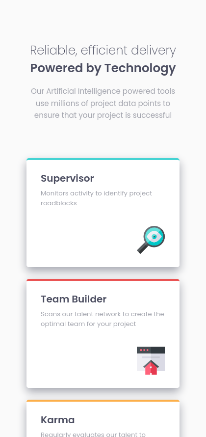
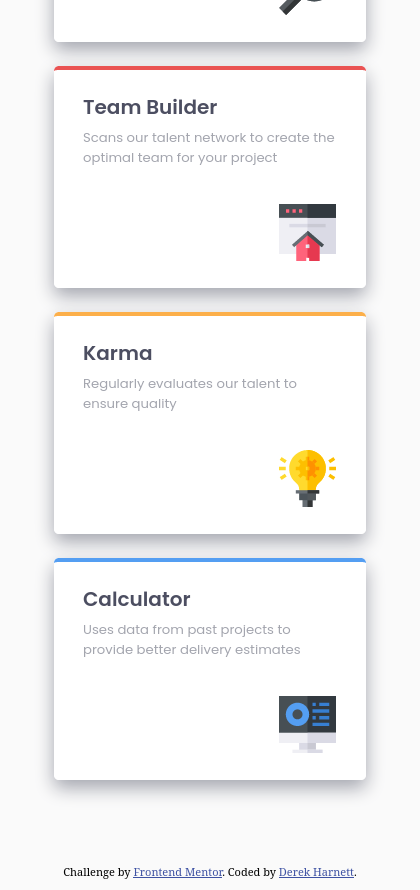

# Frontend Mentor - Four card feature section solution

This is a solution to the [Four card feature section challenge on Frontend Mentor](https://www.frontendmentor.io/challenges/four-card-feature-section-weK1eFYK). Frontend Mentor challenges help you improve your coding skills by building realistic projects. 

## Table of contents

- [Overview](#overview)
  - [The challenge](#the-challenge)
  - [Screenshots](#screenshots)
  - [Links](#links)
- [My process](#my-process)
  - [Built with](#built-with)
  - [What I learned](#what-i-learned)
  - [Continued development](#continued-development)
- [Author](#author)
- [Acknowledgments](#acknowledgments)

## Overview

### The challenge

Users should be able to:

- View the optimal layout for the site depending on their device's screen size

### Screenshots

### Links

- Solution URL: [https://github.com/harnettd/four-card-feature-section](https://github.com/harnettd/four-card-feature-section)
- Live Site URL: [https://harnettd.github.io/four-card-feature-section/](https://harnettd.github.io/four-card-feature-section/)

## My process

### Built with

- HTML5
- CSS including Flexbox using the OOCSS methodology
- Sass

### What I learned

In completing this project, I reinforced several techniques and ideas that I had learned for previous projects, namely Flexbox, 
OOCSS, and placeholder classes in Sass.

### Continued development

- While I have used Flexbox on most of the Frontend Mentor projects that I have completed so far, I have yet to use CSS Grid. 
Looking at some of the remaining Newbie projects, it looks like I'll need to learn CSS Grid sooner rather than ater.

- I still have troube reproducing a box-shadow from a design. Mine always come out too dark.

## Author

- Github - [Derek Harnett](https://github.com/harnettd)
- Frontend Mentor - [@harnettd](https://www.frontendmentor.io/profile/harnettd)

## Acknowledgements

- Thanks to [Frontend Mentor](https://www.frontendmentor.io/) for posting this challenge.